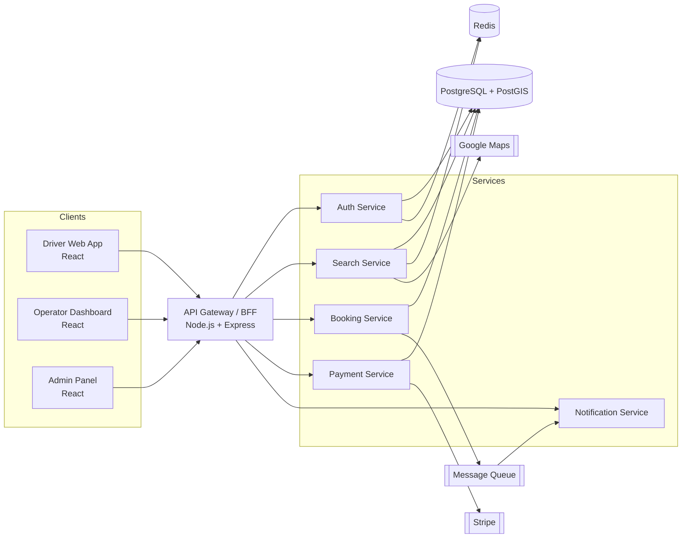

# ParkSpot — Software Documentation

> A scalable, SpotHero-style parking marketplace built with **React** (frontend) and **Node.js** (backend).

This repository contains the **complete software documentation** to build ParkSpot step by step — from architecture and database design to the API contract, and a phase-by-phase build roadmap.

---

## What is ParkSpot?

ParkSpot is a two-sided parking marketplace (clone of [SpotHero](https://spothero.com)) where:

- **Drivers** search for parking near a destination, compare garages/lots by price & distance on a map, book and pre-pay for a spot, and receive a digital parking pass.
- **Operators (hosts)** list their facilities, set rates and availability, manage inventory, and track earnings via a dashboard.
- **Admins** moderate listings, manage users, resolve disputes, and view platform analytics.

---

## How to read this documentation

Read the docs **in order** the first time. After that, use them as reference.

| # | Document | What it covers |
|---|----------|----------------|
| 00 | [Product Overview & Requirements](docs/00-product-overview.md) | Vision, personas, feature list, user stories, MVP vs later |
| 01 | [System Architecture](docs/01-architecture.md) | High-level architecture, services, scalability strategy, diagrams |
| 02 | [Tech Stack & Decisions](docs/02-tech-stack.md) | Chosen technologies and *why* (ADRs) |
| 03 | [Database Design](docs/03-database-design.md) | ER diagram, schema, geospatial search, indexes |
| 04 | [API Specification](docs/04-api-spec.md) | REST endpoints, request/response, auth, errors |
| 05 | [Frontend Architecture](docs/05-frontend-architecture.md) | React structure, routing, state, components, design system |
| 06 | [Authentication & Security](docs/06-auth-security.md) | JWT, roles, OWASP, PCI, rate limiting |
| 07 | [Payments & Booking Flow](docs/07-payments-booking.md) | Stripe integration, booking lifecycle, payouts, refunds |
| 08 | [Search & Geolocation](docs/08-search-geolocation.md) | Google Maps, geocoding, availability, ranking |
| 09 | [Infrastructure & DevOps](docs/09-infra-devops.md) | Environments, Docker, CI/CD, observability |
| 10 | [Build Roadmap](docs/10-roadmap.md) | Phase-by-phase, sprint-by-sprint build plan |
| 11 | [Project Setup Guide](docs/11-project-setup.md) | Repo structure, local dev, env vars, getting started |

> 💡 Diagrams are written in **Mermaid**. They render natively on GitHub/GitLab and in most Markdown viewers (VS Code with the Mermaid extension).

---

## Quick architecture snapshot

---

## Tech stack at a glance

- **Frontend:** React 18 + TypeScript, Vite, React Router, TanStack Query, Zustand, Tailwind CSS, Google Maps JS API
- **Backend:** Node.js + TypeScript, Express (or NestJS), Prisma ORM
- **Database:** PostgreSQL + PostGIS (geospatial), Redis (cache/sessions/queues)
- **Payments:** Stripe (Payment Intents + Connect for operator payouts)
- **Maps:** Google Maps Platform (Maps JS, Places, Geocoding, Directions)
- **Infra:** Docker, Nginx, CI/CD (GitHub Actions), deployable to AWS/GCP/Render/Fly.io

See [02-tech-stack.md](docs/02-tech-stack.md) for rationale.

---

## Suggested build order (TL;DR)

1. **Phase 0** — Setup: repos, tooling, CI, env config
2. **Phase 1** — Auth + user accounts
3. **Phase 2** — Operator listings (facilities, spaces, rates)
4. **Phase 3** — Driver search + map
5. **Phase 4** — Booking + Stripe payments
6. **Phase 5** — Parking pass, notifications, reviews
7. **Phase 6** — Operator dashboard + payouts
8. **Phase 7** — Admin panel + analytics
9. **Phase 8** — Monthly/airport parking, business profiles, scale hardening

Full detail in [10-roadmap.md](docs/10-roadmap.md).

---

*This documentation is a living document. Update the relevant file whenever a decision changes, and record significant choices as ADRs in [02-tech-stack.md](docs/02-tech-stack.md).*
