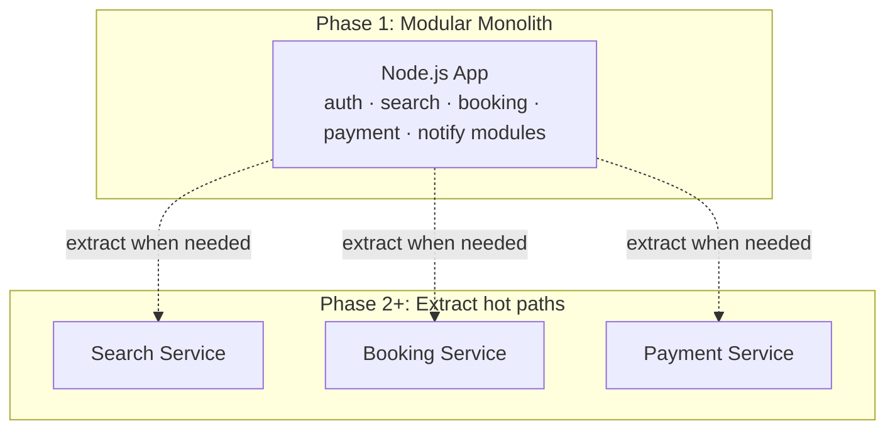
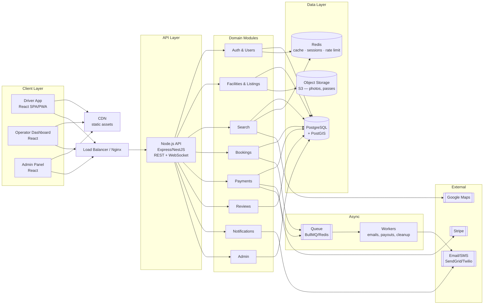
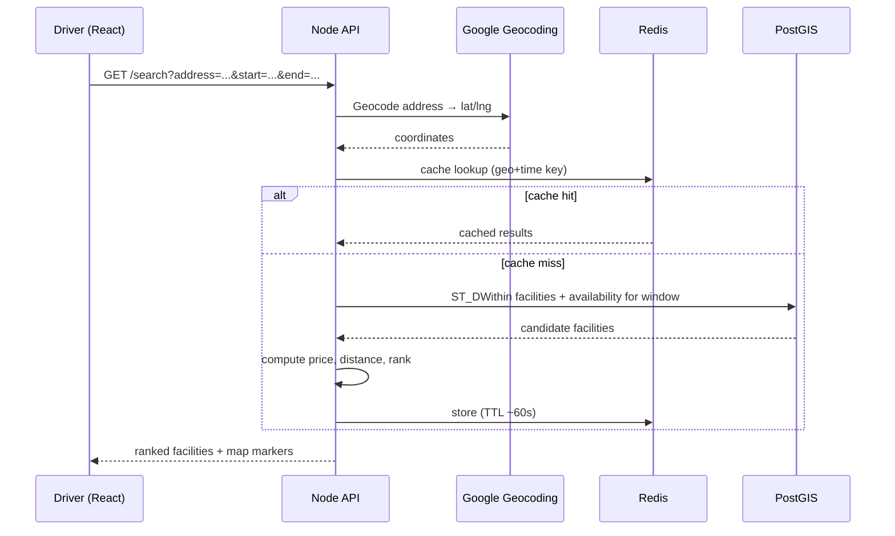
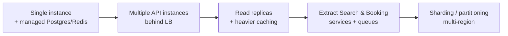

# 01 — System Architecture

## 1. Architectural approach

Start with a **modular monolith** (a single Node.js codebase organized into clear domain modules) and a clean separation between frontend apps. This is the pragmatic path to launch fast while keeping a clear road to **extract microservices** later as load grows.

> **Why modular monolith first?** Microservices add operational overhead (networking, distributed transactions, deployment complexity) that slows down an early-stage product. A well-structured monolith with module boundaries gives you 90% of the scalability with 10% of the complexity, and the boundaries make later extraction straightforward.



---

## 2. High-level architecture



---

## 3. Component responsibilities

| Module | Responsibility |
|--------|---------------|
| **Auth & Users** | Registration, login, JWT issuance/refresh, roles (driver/operator/admin), profiles, vehicles, payment methods, business profiles |
| **Facilities & Listings** | CRUD for facilities, spaces, rate rules, availability, photos, amenities, moderation status |
| **Search** | Geospatial + temporal availability search, ranking, filters; reads from PostGIS, caches popular queries in Redis |
| **Bookings** | Reservation lifecycle, capacity/availability enforcement (no oversell), pass generation, edits/cancellations |
| **Payments** | Stripe Payment Intents, refunds, Stripe Connect onboarding & payouts, webhooks, ledger |
| **Reviews** | Ratings/reviews after completed bookings, aggregation |
| **Notifications** | Email/SMS/push for confirmations, reminders, cancellations |
| **Admin** | Moderation, user management, disputes, analytics |

---

## 4. Request flow examples

### 4.1 Search flow



### 4.2 Booking + payment flow (no double-booking)

```mermaid
sequenceDiagram
    participant U as Driver
    participant API as Booking Module
    participant DB as PostgreSQL
    participant S as Stripe

    U->>API: POST /bookings (facility, window, vehicle)
    API->>DB: BEGIN tx; SELECT capacity ... FOR UPDATE
    API->>DB: count overlapping confirmed/held reservations
    alt capacity available
        API->>DB: INSERT reservation (status=PENDING, hold expiry)
        API->>DB: COMMIT
        API->>S: Create PaymentIntent (amount locked)
        S-->>API: client_secret
        API-->>U: reservation id + client_secret
        U->>S: Confirm payment (Stripe.js)
        S-->>API: webhook payment_intent.succeeded
        API->>DB: UPDATE reservation status=CONFIRMED; generate pass
        API-->>U: confirmation + pass (via webhook/poll)
    else no capacity
        API->>DB: ROLLBACK
        API-->>U: 409 Conflict (sold out for window)
    end
```

> **Key technique:** a short-lived **PENDING hold** (e.g., 10 min) reserves capacity while the user pays. Use `SELECT ... FOR UPDATE` (or an exclusion constraint) to serialize concurrent attempts and prevent overselling. A background worker expires stale holds.

---

## 5. Scalability strategy

| Concern | Strategy |
|---------|----------|
| **Stateless API** | No in-memory session; JWT + Redis. Horizontally scale API behind a load balancer. |
| **Read-heavy search** | Cache hot geo/time queries in Redis (short TTL). Add PostgreSQL **read replicas**; route search reads to replicas. |
| **Geospatial performance** | PostGIS **GiST index** on location; `ST_DWithin` for radius queries. |
| **No oversell under load** | Row-level locks / exclusion constraints + short holds; idempotent booking creation. |
| **Spiky workloads (events)** | Queue async work (emails, payouts, pass gen). Autoscale workers. |
| **Static & media** | Serve React build + images via **CDN**; store media in object storage (S3). |
| **Hot data** | Cache facility details, rate rules in Redis. |
| **Database growth** | Partition large tables (e.g., reservations by month) later; archive old data. |
| **Service extraction** | Extract Search/Booking/Payment into independent services when a module becomes a bottleneck. |
| **Idempotency** | Idempotency keys on booking & payment endpoints to safely retry. |

### Scaling timeline


---

## 6. Cross-cutting concerns

- **Auth/RBAC:** middleware validates JWT and role per route. See [06-auth-security.md](06-auth-security.md).
- **Validation:** schema validation (Zod/Joi) at the API boundary.
- **Error handling:** centralized error middleware → consistent error envelope (see [04-api-spec.md](04-api-spec.md)).
- **Logging/metrics/tracing:** structured logs, request IDs, metrics, traces. See [09-infra-devops.md](09-infra-devops.md).
- **Config:** 12-factor env vars; secrets in a secret manager.
- **Time:** store UTC; convert per facility timezone in presentation.

---

## 7. Data consistency notes

- Money + reservations are **strongly consistent** (single Postgres, transactions).
- Search results can be **eventually consistent** (cached, short TTL) — acceptable, with a final capacity check at booking time.
- Stripe is the **source of truth for payment state**; reconcile via webhooks + a payments ledger table.
