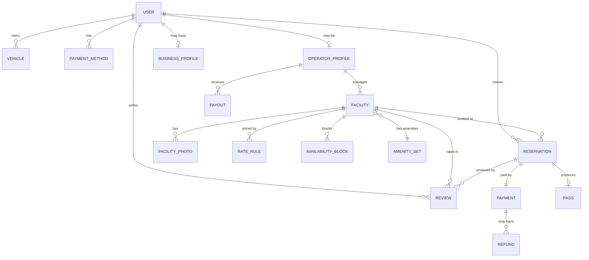

# 03 — Database Design

Database: **PostgreSQL 15+ with the PostGIS extension**. ORM: **Prisma** (with raw SQL for geospatial queries).

---

## 1. Entity-Relationship Diagram



---

## 2. Tables (schema overview)

> Types shown are conceptual. Use Prisma schema (section 5) as the source of truth. All tables have `id` (UUID), `created_at`, `updated_at` unless noted.

### users
| Column | Type | Notes |
|--------|------|-------|
| id | uuid PK | |
| email | citext UNIQUE | login |
| password_hash | text | argon2/bcrypt; null if OAuth-only |
| full_name | text | |
| phone | text | |
| role | enum(`driver`,`operator`,`admin`) | a user may act as driver+operator |
| email_verified_at | timestamptz | |
| status | enum(`active`,`suspended`) | |

### operator_profiles
| Column | Type | Notes |
|--------|------|-------|
| id | uuid PK | |
| user_id | uuid FK → users | |
| company_name | text | |
| stripe_account_id | text | Stripe Connect account |
| payout_status | enum(`pending`,`enabled`,`restricted`) | |
| verified_at | timestamptz | KYC complete |

### business_profiles
| Column | Type | Notes |
|--------|------|-------|
| id | uuid PK | |
| user_id | uuid FK → users | |
| company_name, tax_id, billing_email | text | |

### vehicles
| Column | Type | Notes |
|--------|------|-------|
| id | uuid PK | |
| user_id | uuid FK | |
| license_plate | text | used for plate-based entry |
| state, make, model, color | text | |
| is_default | boolean | |

### payment_methods
| Column | Type | Notes |
|--------|------|-------|
| id | uuid PK | |
| user_id | uuid FK | |
| stripe_payment_method_id | text | never store raw card data |
| brand, last4, exp_month, exp_year | text/int | display only |
| is_default | boolean | |

### facilities
| Column | Type | Notes |
|--------|------|-------|
| id | uuid PK | |
| operator_id | uuid FK → operator_profiles | |
| name | text | |
| description | text | |
| type | enum(`garage`,`lot`,`valet`) | |
| address_line1, line2, city, state, postal_code, country | text | |
| location | `geography(Point,4326)` | **PostGIS** — for radius search |
| timezone | text | IANA, e.g. `America/Chicago` |
| total_capacity | int | max concurrent vehicles |
| height_clearance_cm | int | nullable |
| access_instructions | text | shown on pass |
| status | enum(`draft`,`pending_review`,`active`,`paused`,`rejected`) | moderation |
| avg_rating | numeric(2,1) | denormalized aggregate |
| review_count | int | denormalized |

### amenity_sets (or facility_amenities join)
Booleans: `covered`, `ev_charging`, `ada_accessible`, `valet`, `in_out_privileges`, `gated`, `attended`, `tailgating`, `motorcycle`, `oversized`.
> Implement as columns on a `facility_amenities` table (1:1 with facility) or a tag join table. Columns are simpler for filtering.

### facility_photos
| id, facility_id FK, url, sort_order, is_cover |

### rate_rules
Defines price for time windows. Evaluate at booking/search to compute price.
| Column | Type | Notes |
|--------|------|-------|
| id | uuid PK | |
| facility_id | uuid FK | |
| rate_type | enum(`hourly`,`daily`,`monthly`,`event`,`flat`) | |
| price_cents | int | |
| min_minutes, max_minutes | int | applicable duration bounds |
| day_of_week_mask | int | bitmask Mon–Sun, nullable |
| start_time, end_time | time | time-of-day window, nullable |
| valid_from, valid_to | date | event/seasonal windows, nullable |
| priority | int | higher wins on overlap |

### availability_blocks
Capacity overrides / blackouts.
| id, facility_id FK, start_at, end_at, capacity_override (int, nullable), reason |

### reservations
The core booking record.
| Column | Type | Notes |
|--------|------|-------|
| id | uuid PK | |
| code | text UNIQUE | human-friendly confirmation code |
| driver_id | uuid FK → users | |
| facility_id | uuid FK | |
| vehicle_id | uuid FK | nullable |
| business_profile_id | uuid FK | nullable |
| start_at | timestamptz | UTC |
| end_at | timestamptz | UTC |
| status | enum(`pending`,`confirmed`,`cancelled`,`completed`,`no_show`,`expired`) | |
| hold_expires_at | timestamptz | for pending holds |
| base_price_cents | int | locked at booking |
| service_fee_cents | int | |
| tax_cents | int | |
| total_cents | int | |
| currency | char(3) | `USD` |
| cancellation_policy | jsonb | snapshot at booking |
| idempotency_key | text | dedupe creation |

> Index for overlap detection: `(facility_id, start_at, end_at)` plus a status filter. Consider a PostGIS/`tstzrange` **exclusion constraint** to hard-prevent oversell (see §4).

### payments
| Column | Type | Notes |
|--------|------|-------|
| id | uuid PK | |
| reservation_id | uuid FK | |
| stripe_payment_intent_id | text | |
| amount_cents, currency | | |
| status | enum(`requires_payment`,`processing`,`succeeded`,`failed`,`refunded`,`partially_refunded`) | mirrors Stripe |
| receipt_url | text | |

### refunds
| id, payment_id FK, stripe_refund_id, amount_cents, reason, status |

### payouts
| id, operator_id FK, stripe_transfer_id, amount_cents, period_start, period_end, status, reservation_ids (jsonb or join) |

### reviews
| id, reservation_id FK (unique), facility_id FK, driver_id FK, rating (1–5), comment, created_at |

### promo_codes
| id, code UNIQUE, type(`percent`,`fixed`), value, max_redemptions, used_count, valid_from, valid_to, min_amount_cents, active |

### notifications (optional persistence)
| id, user_id FK, type, channel(`email`,`sms`,`push`), payload jsonb, sent_at, read_at |

### audit_log (admin/compliance)
| id, actor_user_id, action, entity_type, entity_id, metadata jsonb, created_at |

---

## 3. Geospatial search with PostGIS

Enable the extension and index the location column:

```sql
CREATE EXTENSION IF NOT EXISTS postgis;

-- facilities.location is geography(Point, 4326)
CREATE INDEX idx_facilities_location ON facilities USING GIST (location);
```

Find active facilities within a radius of a point, nearest first:

```sql
SELECT
  f.id, f.name, f.type, f.total_capacity,
  ST_Distance(f.location, ST_MakePoint(:lng, :lat)::geography) AS distance_m
FROM facilities f
WHERE f.status = 'active'
  AND ST_DWithin(
        f.location,
        ST_MakePoint(:lng, :lat)::geography,
        :radius_m            -- e.g., 2000 meters
      )
ORDER BY distance_m ASC
LIMIT 50;
```

Then, for each candidate, the application (or a CTE) checks **availability for the requested window** (capacity minus overlapping reservations) and **computes price** from `rate_rules`.

Insert a facility point:
```sql
UPDATE facilities
SET location = ST_SetSRID(ST_MakePoint(:lng, :lat), 4326)::geography
WHERE id = :id;
```

---

## 4. Preventing double-booking (no oversell)

Two complementary techniques:

**A. Transactional capacity check (application-enforced):**
```sql
BEGIN;
-- Lock the facility row to serialize concurrent bookings for it
SELECT total_capacity FROM facilities WHERE id = :facility_id FOR UPDATE;

-- Count overlapping active reservations in the window
SELECT count(*) FROM reservations
WHERE facility_id = :facility_id
  AND status IN ('pending','confirmed')
  AND tstzrange(start_at, end_at) && tstzrange(:start, :end);

-- If count < capacity: INSERT the reservation (status='pending', hold_expires_at = now()+10min)
COMMIT;
```

**B. Database-level guard (defense in depth):** when capacity is 1 (e.g., a single dedicated space), an exclusion constraint can hard-prevent overlaps:
```sql
ALTER TABLE reservations
  ADD CONSTRAINT no_overlap_per_space
  EXCLUDE USING gist (
    space_id WITH =,
    tstzrange(start_at, end_at) WITH &&
  ) WHERE (status IN ('pending','confirmed'));
```
> For pooled capacity (>1), rely on the transactional counter approach (A). A background worker expires `pending` reservations whose `hold_expires_at` has passed, freeing capacity.

---

## 5. Prisma schema (starter excerpt)

```prisma
// schema.prisma
generator client { provider = "prisma-client-js" }
datasource db {
  provider   = "postgresql"
  url        = env("DATABASE_URL")
  extensions = [postgis]
}

enum Role { driver operator admin }
enum FacilityType { garage lot valet }
enum FacilityStatus { draft pending_review active paused rejected }
enum ReservationStatus { pending confirmed cancelled completed no_show expired }

model User {
  id            String   @id @default(uuid())
  email         String   @unique
  passwordHash  String?
  fullName      String
  phone         String?
  role          Role     @default(driver)
  status        String   @default("active")
  vehicles      Vehicle[]
  reservations  Reservation[]
  operator      OperatorProfile?
  createdAt     DateTime @default(now())
  updatedAt     DateTime @updatedAt
}

model Facility {
  id            String   @id @default(uuid())
  operatorId    String
  operator      OperatorProfile @relation(fields: [operatorId], references: [id])
  name          String
  type          FacilityType
  // location handled via raw SQL: geography(Point,4326)
  timezone      String
  totalCapacity Int
  status        FacilityStatus @default(draft)
  avgRating     Decimal? @db.Decimal(2,1)
  reviewCount   Int      @default(0)
  rateRules     RateRule[]
  reservations  Reservation[]
  createdAt     DateTime @default(now())
  updatedAt     DateTime @updatedAt
  @@index([status])
}

model Reservation {
  id              String   @id @default(uuid())
  code            String   @unique
  driverId        String
  driver          User     @relation(fields: [driverId], references: [id])
  facilityId      String
  facility        Facility @relation(fields: [facilityId], references: [id])
  startAt         DateTime
  endAt           DateTime
  status          ReservationStatus @default(pending)
  holdExpiresAt   DateTime?
  basePriceCents  Int
  serviceFeeCents Int
  taxCents        Int
  totalCents      Int
  currency        String   @default("USD")
  idempotencyKey  String?  @unique
  payment         Payment?
  createdAt       DateTime @default(now())
  updatedAt       DateTime @updatedAt
  @@index([facilityId, startAt, endAt])
  @@index([driverId])
}
// ... RateRule, Payment, OperatorProfile, Vehicle, Review, etc.
```

> **Note:** Prisma doesn't fully model PostGIS `geography`. Keep the column via a migration (`ALTER TABLE facilities ADD COLUMN location geography(Point,4326);`) and use `prisma.$queryRaw` for geo queries.

---

## 6. Key indexes

| Table | Index | Purpose |
|-------|-------|---------|
| facilities | GiST(location) | radius search |
| facilities | (status) | filter active |
| reservations | (facility_id, start_at, end_at) | overlap checks |
| reservations | (driver_id) | user history |
| reservations | (status, hold_expires_at) | hold-expiry sweeper |
| rate_rules | (facility_id, priority) | price resolution |
| users | unique(email) | login |
| payments | (stripe_payment_intent_id) | webhook reconciliation |

---

## 7. Migrations & seed
- Use **Prisma Migrate** (`prisma migrate dev` / `deploy`) for schema changes; add a **raw SQL migration** for the PostGIS extension, `location` column, GiST index, and exclusion constraint.
- Provide a **seed script** with: 1 admin, a few operators, ~20 facilities across a city with realistic coordinates, rate rules, and sample reservations for local testing.

---

## 8. Data retention & privacy
- Never store raw card numbers (Stripe tokens only).
- Hash passwords with argon2/bcrypt.
- Soft-delete users (anonymize PII) to preserve booking/financial history integrity.
- Keep an `audit_log` for admin/financial actions.
