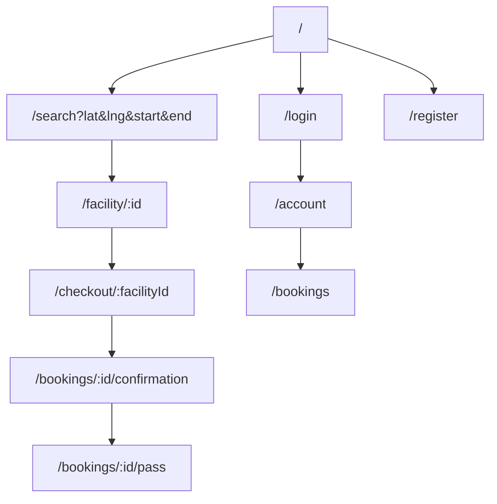
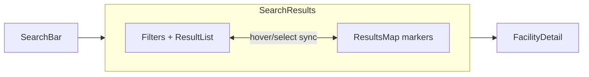

# 05 — Frontend Architecture (React)

Three React apps share a common design system and API client. You can build them as **separate apps in a monorepo** (recommended) or as **role-based areas within one app**. This doc assumes a monorepo with shared packages.

---

## 1. App breakdown

| App | Audience | Notes |
|-----|----------|-------|
| **web (driver)** | Public + drivers | SEO-relevant landing/search; consider Next.js if SEO matters |
| **operator** | Operators | Authenticated dashboard |
| **admin** | Staff | Internal, gated |

Shared packages: `ui` (components), `api-client`, `types` (shared TS types/Zod schemas), `config`.

```
apps/
  web/         # driver app (Vite or Next.js)
  operator/    # operator dashboard (Vite)
  admin/       # admin panel (Vite)
packages/
  ui/          # design system (buttons, inputs, modal, map wrapper)
  api-client/  # typed fetch/axios client + React Query hooks
  types/       # shared TS types + Zod schemas (mirror backend)
  config/      # eslint, tsconfig, tailwind preset
```

> Use **pnpm workspaces** or **Turborepo** to manage the monorepo.

---

## 2. Tech choices (recap)
React 18 + TypeScript · Vite · React Router v6 · TanStack Query (server state) · Zustand (client state) · React Hook Form + Zod · Tailwind CSS + shadcn/ui/Radix · @react-google-maps/api · Stripe React Elements · Vitest/RTL/Playwright.

---

## 3. Driver app structure

```
apps/web/src/
  main.tsx
  app/
    router.tsx
    providers.tsx        # QueryClient, Stripe, Maps, Auth providers
  pages/
    Home.tsx             # hero + search bar
    SearchResults.tsx    # map + list
    FacilityDetail.tsx
    Checkout.tsx
    BookingConfirmation.tsx
    bookings/
      MyBookings.tsx
      BookingDetail.tsx
      ParkingPass.tsx
    account/
      Profile.tsx
      Vehicles.tsx
      PaymentMethods.tsx
    auth/
      Login.tsx
      Register.tsx
  features/
    search/              # SearchBar, Filters, ResultCard, ResultsMap
    booking/             # BookingSummary, PriceBreakdown, CheckoutForm
    facility/            # PhotoGallery, AmenityList, ReviewList
  components/            # app-specific composites
  hooks/                 # useSearch, useDebounce, useGeolocation
  lib/                   # apiClient, maps, stripe, date utils
  store/                 # zustand stores (auth, searchFilters)
  styles/
```

---

## 4. Routing (driver app)



Protected routes (`/account`, `/bookings`, `/checkout`) require auth; redirect to `/login?redirect=...`.

---

## 5. State management strategy

| State type | Tool | Examples |
|------------|------|----------|
| **Server/cache state** | TanStack Query | search results, facility details, bookings, profile |
| **Global client state** | Zustand | auth/session, current search params/filters, UI (modals) |
| **Form state** | React Hook Form | checkout, login, listing forms |
| **URL state** | React Router search params | search query, filters (shareable links) |

> Rule of thumb: anything that comes from the API lives in React Query; keep Zustand small.

Example query hook (in `packages/api-client`):
```ts
export function useSearch(params: SearchParams) {
  return useQuery({
    queryKey: ['search', params],
    queryFn: () => apiClient.get('/search', { params }).then(r => r.data),
    enabled: !!params.lat && !!params.lng,
    staleTime: 60_000,
  });
}
```

---

## 6. Key screens & components

### Search results (the core screen)
- **Split layout:** scrollable result list (left) + Google Map with price markers (right); collapses to tabs on mobile.
- **SearchBar:** Places autocomplete + date/time range pickers.
- **Filters:** amenities, price, type, rating.
- **ResultCard:** photo, name, distance/walk time, price, rating, "Book".
- **Map markers** show price; hover/selection syncs list ↔ map.



### Facility detail
Photo gallery, amenities, rates table, map + directions, reviews, sticky **booking widget** (date/time + price quote + "Reserve").

### Checkout
Booking summary, price breakdown, vehicle selector, **Stripe Payment Element**, promo code, confirm → confirmation + pass.

### Parking pass
Big **QR code**, confirmation code, facility access instructions, vehicle/plate, time window, "Get directions", "Add to wallet" (later).

---

## 7. Operator dashboard structure (highlights)
```
apps/operator/src/pages/
  Dashboard.tsx          # KPIs: today's reservations, occupancy, earnings
  facilities/            # list, create/edit (multi-step form), photos, rates, availability
  reservations/          # incoming list, validate pass (scanner)
  earnings/              # earnings + payouts
  onboarding/            # Stripe Connect onboarding
  settings/
```
Multi-step **facility creation wizard**: Basics → Location (map pin) → Amenities → Photos → Rates → Review & Submit.

---

## 8. Admin panel (highlights)
```
apps/admin/src/pages/
  Overview.tsx           # GMV, bookings, revenue charts
  Moderation.tsx         # listing approval queue
  Users.tsx              # search/suspend/verify
  Bookings.tsx           # search + manual refund
  PromoCodes.tsx
  Cities.tsx
```

---

## 9. Design system & UX
- **Tailwind** + **shadcn/ui** (Radix primitives) for accessible, consistent components.
- Tokens: colors, spacing, radius, typography in a Tailwind preset (`packages/config`).
- Components: Button, Input, Select, DatePicker/TimeRange, Modal, Drawer, Toast, Card, Badge, Skeleton, Map, PriceTag, Rating.
- **Responsive & mobile-first**; search results become a map/list toggle on mobile.
- **Accessibility (a11y):** semantic HTML, keyboard nav, ARIA, color contrast, focus states.
- **PWA:** installable, offline shell, cached pass view (so the QR works at the gate without signal).

> ⚠️ **Preview note:** the in-app workspace preview sandbox has no network access, so Google Maps/Stripe/external fonts won't load there. Use inline styles/data-URIs for any static mockups you preview; the real app works fully in a browser.

---

## 10. Performance
- **Code-split** by route (`React.lazy`/dynamic import).
- **Debounce** autocomplete & map-driven searches.
- **Virtualize** long result lists (react-virtual).
- **Image optimization:** responsive images, lazy loading, CDN.
- **Prefetch** facility detail on result hover.
- Cache search results (React Query `staleTime`) to avoid refetch on back-nav.

---

## 11. Testing
- **Unit/component:** Vitest + React Testing Library (components, hooks).
- **E2E:** Playwright for critical flows (search → book → pass; operator create listing).
- **Mock API:** MSW (Mock Service Worker) for isolated frontend dev/tests.
