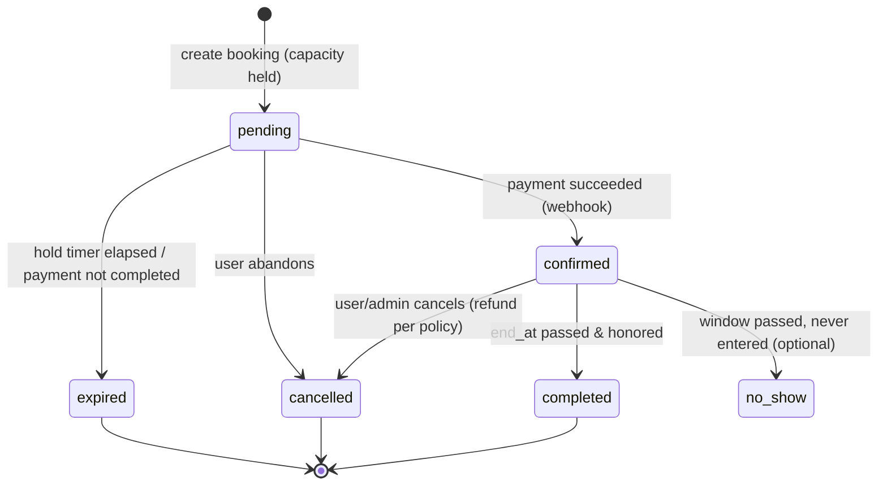
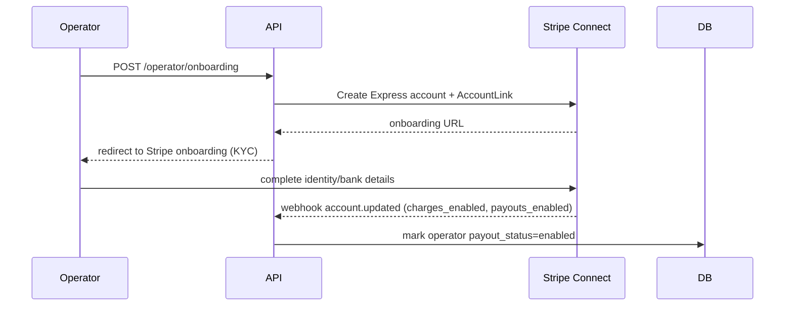
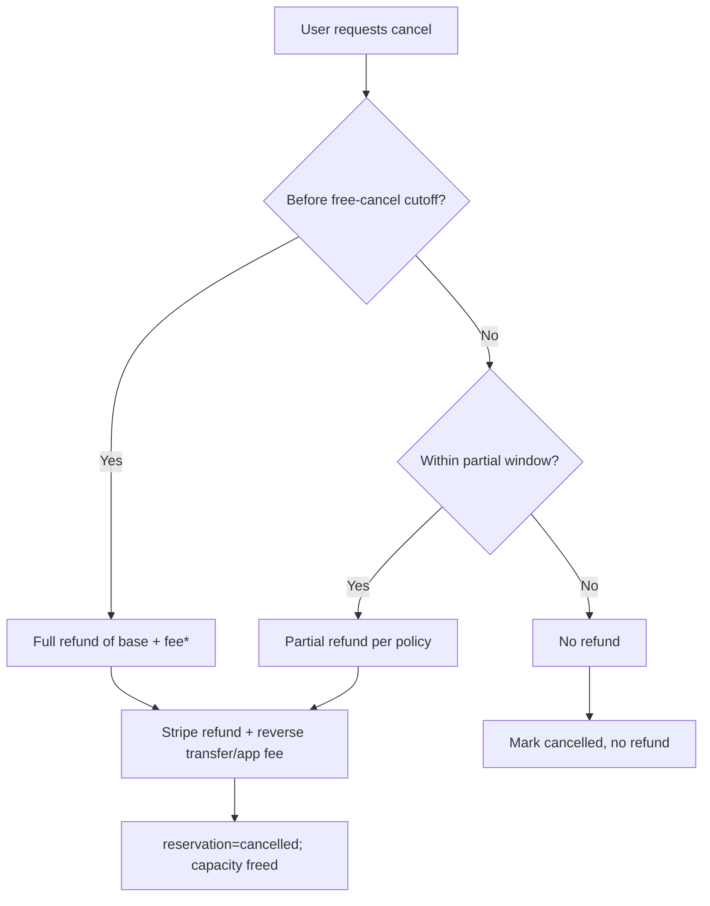

# 07 — Payments & Booking Flow

Payments via **Stripe**: **Payment Intents** to charge drivers, **Stripe Connect (Express)** to onboard operators and pay them out. The platform takes a service fee.

---

## 1. Booking lifecycle (state machine)



| Status | Meaning | Capacity counted? |
|--------|---------|-------------------|
| `pending` | Hold placed, awaiting payment | Yes (until hold expires) |
| `confirmed` | Paid, pass issued | Yes |
| `expired` | Hold lapsed before payment | No |
| `cancelled` | Cancelled (refund per policy) | No |
| `completed` | Window elapsed successfully | No (historical) |
| `no_show` | Never used | No |

---

## 2. End-to-end booking + payment

```mermaid
sequenceDiagram
    participant U as Driver (React)
    participant API as API
    participant DB as Postgres
    participant S as Stripe
    participant Q as Queue/Worker

    U->>API: POST /bookings (Idempotency-Key)
    API->>DB: tx: lock facility, check capacity, INSERT pending (hold 10m)
    API->>S: Create PaymentIntent(amount, customer, metadata.reservationId)
    S-->>API: clientSecret
    API-->>U: reservationId + clientSecret
    U->>S: Stripe.js confirmPayment(clientSecret)
    S-->>U: 3DS if needed → success
    S-->>API: webhook payment_intent.succeeded
    API->>DB: UPDATE reservation=confirmed; UPSERT payment=succeeded
    API->>Q: enqueue: generate pass, send confirmation email
    Q-->>U: email + pass available
    Note over API,DB: If payment fails → reservation stays pending → expires → capacity freed
```

### Why a "hold" + idempotency
- The **PENDING hold** reserves capacity while the user completes 3-D Secure / payment, preventing the spot being sold twice.
- A **worker** sweeps expired holds (`status='pending' AND hold_expires_at < now()`) → set `expired`, freeing capacity.
- **Idempotency-Key** ensures retries (network hiccups, double-clicks) don't create duplicate reservations/charges.

---

## 3. Pricing calculation

```
basePrice   = resolveRate(facility, start, end)     // from rate_rules by type/priority/time
serviceFee  = round(basePrice * PLATFORM_FEE_PCT)   // e.g., 15%
discount    = applyPromo(promoCode, basePrice)      // optional
tax         = round((basePrice - discount) * taxRate)  // Stripe Tax or table
total       = basePrice - discount + serviceFee + tax
```
- **Lock the price** into the reservation at creation; never recompute at confirmation.
- Store breakdown (`base_price_cents`, `service_fee_cents`, `tax_cents`, `total_cents`).

### Rate resolution
Pick the matching `rate_rule` for the window by `rate_type`, duration bounds, day/time match, validity dates, and highest `priority`. Examples:
- Hourly for short stays; daily cap for long stays; event rate when `valid_from/to` covers the window; monthly for subscriptions.

---

## 4. Stripe Connect — operator onboarding & payouts



### Money flow options
- **Destination charges** (recommended): platform creates the PaymentIntent, sets `application_fee_amount` (your service fee) and `transfer_data.destination = operatorStripeAccount`. Stripe automatically routes the operator's share and collects your fee.
- **Separate charges & transfers:** charge on platform, then create `transfer` to operator after the reservation start/completion (more control over timing/refunds).

```
Driver pays total (base + fee + tax)
  → platform keeps service fee (application_fee_amount) + remits tax
  → operator receives base price (minus Stripe/Connect fees)
  → Stripe payout to operator bank on schedule
```

### Payout timing
- Configure a **payout policy** (e.g., funds released to operator after reservation `start_at` or `completed`, settled daily/weekly). Hold for cancellation window to simplify refunds.

---

## 5. Cancellations & refunds


- **Policy snapshot** is stored on the reservation at booking time (`cancellation_policy` jsonb) so later policy changes don't affect existing bookings.
- Refund via Stripe `refunds.create`; for destination charges, also reverse the transfer/application fee as appropriate.
- Service fee refundability is a business decision (often non-refundable after cutoff).
- Edits (changing times) = recompute price; charge difference or refund delta, re-check availability.

---

## 6. Promo codes
- Validate: active, within validity dates, under max redemptions, meets min amount.
- Apply discount to base price before fee/tax (or per business rule).
- Track redemptions atomically (avoid over-redemption under concurrency).

---

## 7. Webhooks (must implement)

| Stripe event | Action |
|--------------|--------|
| `payment_intent.succeeded` | reservation → confirmed; payment → succeeded; enqueue pass+email |
| `payment_intent.payment_failed` | keep pending; notify; allow retry |
| `charge.refunded` | payment → refunded/partially_refunded; reservation → cancelled |
| `account.updated` | update operator `charges_enabled`/`payouts_enabled` |
| `payout.paid` / `payout.failed` | update payout records |

Rules:
- **Verify signature** (`stripe.webhooks.constructEvent`).
- **Idempotent**: dedupe by `event.id` (store processed ids).
- Respond `200` fast; offload heavy work to the queue.
- Reconcile periodically against Stripe in case a webhook is missed.

---

## 8. Financial ledger & reconciliation
- Maintain `payments`, `refunds`, `payouts` tables as your internal ledger.
- Reconcile daily against Stripe balance transactions.
- Surface to operators (earnings) and admins (GMV, revenue, fees).

---

## 9. Edge cases to handle
- Double-submit / retries → idempotency keys.
- Payment succeeds but webhook delayed → client polls reservation status; webhook later confirms (idempotent).
- Hold expires mid-payment → re-validate capacity before confirming; refund if oversold (rare).
- Partial refunds and time edits → recompute deltas carefully.
- Currency/timezone → store cents + UTC; display localized.
- Operator not payout-enabled → block listing from going live or hold funds.
