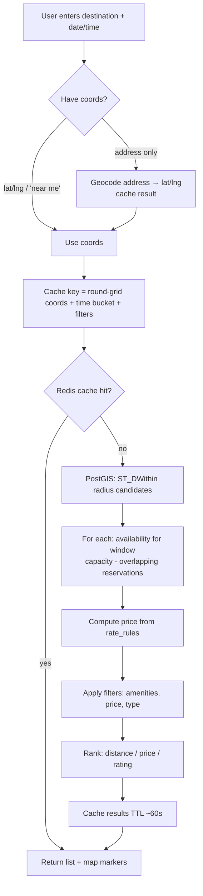

# 08 — Search & Geolocation

The search experience is the heart of the product: *"find available parking near my destination for this time window, ranked sensibly."* Built on **PostGIS** (data/queries) + **Google Maps Platform** (geocoding, maps, places, directions).

---

## 1. Google Maps Platform usage

| API | Where | Purpose |
|-----|-------|---------|
| **Maps JavaScript API** | Frontend | Render map + price markers on results & detail |
| **Places Autocomplete** | Frontend (or proxied) | Address/venue suggestions in the search bar |
| **Geocoding API** | Backend | Convert address → lat/lng (cache results!) |
| **Directions / Distance Matrix** | Backend/Frontend | Walk time from facility to destination; "Get directions" |

> **Cost control:** Geocoding and Places calls are billed. Cache geocoding results (address → coords) in Redis/DB, debounce autocomplete, use **session tokens** for Places autocomplete, and restrict API keys (browser key by referrer, server key by IP).

---

## 2. Search pipeline



---

## 3. Core query (radius + availability + price)

Conceptual SQL combining geo radius with availability:

```sql
WITH candidates AS (
  SELECT
    f.id, f.name, f.type, f.total_capacity, f.timezone,
    ST_Y(f.location::geometry) AS lat,
    ST_X(f.location::geometry) AS lng,
    ST_Distance(f.location, ST_MakePoint(:lng, :lat)::geography) AS distance_m
  FROM facilities f
  WHERE f.status = 'active'
    AND ST_DWithin(f.location, ST_MakePoint(:lng, :lat)::geography, :radius_m)
),
booked AS (
  SELECT facility_id, count(*) AS overlapping
  FROM reservations
  WHERE status IN ('pending','confirmed')
    AND tstzrange(start_at, end_at) && tstzrange(:start, :end)
  GROUP BY facility_id
)
SELECT c.*,
       (c.total_capacity - COALESCE(b.overlapping, 0)) AS spots_left
FROM candidates c
LEFT JOIN booked b ON b.facility_id = c.id
WHERE (c.total_capacity - COALESCE(b.overlapping, 0)) > 0
ORDER BY c.distance_m ASC
LIMIT :limit OFFSET :offset;
```
Then resolve **price** per facility from `rate_rules` for the window (in SQL or app code), apply **amenity filters** (join/columns), and final **ranking**.

> Availability blackouts (`availability_blocks`) should adjust effective capacity for the window.

---

## 4. Ranking

Default sort options exposed to the user: **distance**, **price**, **rating**. Internally you can use a weighted score:

```
score = w1 * normalized(distance)      // closer is better
      + w2 * normalized(price)         // cheaper is better
      + w3 * (1 - normalized(rating))  // higher rating is better
      + w4 * availabilityBoost
```
Start simple (sort by the user's chosen field). Add weighted relevance later. Boost facilities with photos and good ratings.

---

## 5. Availability & price quoting (detail page)

On the facility detail page, when the user adjusts times:
- `GET /facilities/:id/availability?start=&end=` → returns `spotsLeft` + locked price `quote`.
- Re-quote on every time change; show breakdown (base + fee + tax).
- The same availability check runs again (authoritatively) at **booking creation** to avoid race conditions.

---

## 6. Caching strategy

| Cache | Key | TTL | Why |
|-------|-----|-----|-----|
| Geocoding | normalized address | days/permanent | addresses rarely move; saves API cost |
| Search results | grid-snapped coords + time bucket + filters | ~30–60s | absorb spikes, identical nearby searches |
| Facility detail | facility id | minutes (invalidate on edit) | hot reads |
| Rate rules | facility id | minutes (invalidate on edit) | price computation |

**Grid snapping:** round lat/lng to ~3 decimals (~110m) and bucket time to e.g. 15-min slots so near-identical searches share cache entries. Always do a **fresh authoritative availability check at booking time** — cached availability is for display only.

---

## 7. "Near me" & geolocation
- Use the browser **Geolocation API** for "parking near me" (with permission).
- Fall back to IP-based city centroid if denied.
- Let users drag the map / "search this area" to re-query by viewport center.

---

## 8. Map UX details
- Price markers (custom pins showing `$24`), cluster when zoomed out.
- Selecting a list card highlights its marker and vice-versa.
- Show the **destination pin** distinct from facility pins.
- Display **walk time** (Directions/Distance Matrix) from facility to destination.
- Lazy-load the Maps JS SDK; only on pages that need it.

---

## 9. Categories: monthly, airport, event
- **Monthly:** filter facilities offering `monthly` rate rules → subscription booking (recurring via Stripe).
- **Airport:** facility attribute/category (`airport`), show shuttle info, long-term pricing.
- **Event:** when search window matches an `event` rate rule's validity, apply event pricing; optionally surface "event parking near <venue>" landing pages for SEO.

---

## 10. Scaling search
- Read from **Postgres read replicas** for search.
- Heavy caching (above) + CDN for static assets.
- If full-text venue search / faceting grows complex, introduce **Elasticsearch/OpenSearch** later (index facilities + geo + amenities). Not needed for v1 — PostGIS handles it.
- Pre-warm caches for popular cities/venues and big events.
