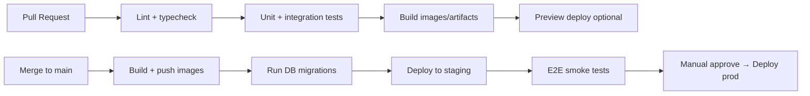

# 09 — Infrastructure & DevOps

## 1. Environments

| Env | Purpose | Data |
|-----|---------|------|
| **local** | Developer machines (docker-compose) | seeded test data, Stripe/Maps **test** keys |
| **staging** | Pre-prod, QA, demos | anonymized/sample data, Stripe test mode |
| **production** | Live | real data, live keys, backups, monitoring |

Each env has isolated databases, secrets, and API keys. Promote via CI/CD (local → staging → prod).

---

## 2. Containerization

`docker-compose.yml` for local dev brings up the full stack:

```yaml
services:
  postgres:   # postgis/postgis image, exposes 5432, volume for data
  redis:      # redis:7
  api:        # node backend, depends_on postgres+redis, mounts src for hot reload
  web:        # vite dev server (driver app)
  operator:   # vite dev server
  admin:      # vite dev server
  mailhog:    # optional: catch outgoing emails locally
  minio:      # optional: S3-compatible object storage locally
```

- Use **multi-stage Dockerfiles** (build → slim runtime) for the API and each frontend (static build served by Nginx/CDN).
- Pin Node LTS; run as non-root; healthcheck endpoints.

---

## 3. Production topology

```mermaid
flowchart TB
    U[Users] --> CF[CDN / WAF<br/>Cloudflare]
    CF --> STATIC[Static frontends<br/>S3+CDN / Vercel / Netlify]
    CF --> LB[Load Balancer]
    LB --> API1[API instance 1]
    LB --> API2[API instance 2]
    LB --> APIn[API instance N]
    API1 & API2 & APIn --> PGW[(Postgres primary)]
    PGW --> PGR[(Read replica)]
    API1 & API2 & APIn --> RDS[(Redis)]
    API1 & API2 & APIn --> OBJ[(Object storage S3)]
    WK[Workers<br/>BullMQ] --> PGW
    WK --> RDS
    API1 -. enqueue .-> RDS
    RDS -. jobs .-> WK
    API1 --> EXT[Stripe / Google / Email]
```



- **Stateless API** behind a load balancer → scale horizontally (containers / autoscaling group / k8s).
- **Managed Postgres** (RDS / Cloud SQL / Neon / Supabase) with **automated backups, PITR, read replica**.
- **Managed Redis** (ElastiCache / Upstash).
- **Object storage** (S3 / R2) for photos & generated passes, served via CDN.
- **Workers** as a separate deployment consuming the queue.

### Hosting recommendation by stage
- **Early/MVP:** Render or Fly.io (API + workers), Neon/Supabase (Postgres+PostGIS), Upstash (Redis), Vercel/Netlify (frontends). Cheap, fast to set up.
- **Scale:** AWS (ECS/EKS + RDS + ElastiCache + S3 + CloudFront) or GCP equivalents.

---

## 4. CI/CD (GitHub Actions)



Pipeline stages:
1. **CI on PR:** ESLint, `tsc --noEmit`, unit/integration tests (Vitest/Jest + Supertest), build.
2. **CD on merge:** build & push Docker images, run `prisma migrate deploy`, deploy to staging, run Playwright smoke tests.
3. **Prod deploy:** manual approval gate, rolling/blue-green deploy, health checks, auto-rollback on failure.

Best practices: cache deps, run DB migrations as a discrete step, use OIDC for cloud auth (no long-lived secrets), tag releases.

---

## 5. Database operations
- **Migrations:** Prisma Migrate (`migrate deploy` in CI); never edit prod schema by hand.
- **Backups:** automated daily + point-in-time recovery; periodically test restores.
- **Read replicas:** route search/read traffic; keep writes on primary.
- **Partitioning (later):** partition `reservations`/`audit_log` by month as volume grows; archive old data to cold storage.
- **Connection pooling:** PgBouncer / Prisma connection limits to avoid exhausting connections under autoscaling.

---

## 6. Observability

| Pillar | Tool | What |
|--------|------|------|
| **Logging** | Pino/Winston → Loki/CloudWatch/Datadog | structured JSON logs, request IDs, no PII/secrets |
| **Metrics** | Prometheus + Grafana | latency, error rate, throughput, queue depth, DB pool, cache hit rate |
| **Tracing** | OpenTelemetry → Jaeger/Tempo | end-to-end request traces across modules |
| **Errors** | Sentry | frontend + backend exceptions with alerts |
| **Uptime** | UptimeRobot/Pingdom | external health checks |

**Health endpoints:** `/health` (liveness) and `/ready` (DB/Redis reachable) for the load balancer/orchestrator.

**Business dashboards:** bookings/min, conversion, GMV, payout failures, webhook lag, oversell incidents (should be zero).

**Alerts:** error-rate spikes, p95 latency, queue backlog, DB CPU/connections, Stripe webhook failures, payout failures.

---

## 7. Performance & reliability targets (example SLOs)
- API p95 latency < 300 ms (reads), < 800 ms (booking write incl. Stripe).
- 99.9% uptime for the API.
- Zero oversell incidents.
- Webhook processing lag < 1 min.

Techniques: caching (Redis/CDN), read replicas, async queues for non-critical work, graceful degradation (if Maps is slow, still show cached results), circuit breakers/timeouts on external calls, retries with backoff.

---

## 8. Security ops (infra)
- Secrets in a secret manager; injected at runtime, never in images/repo.
- Least-privilege IAM and DB roles.
- WAF/CDN for DDoS; rate limiting at edge + app.
- Regular dependency scanning (Dependabot), image scanning (Trivy).
- TLS everywhere; rotate certs automatically (managed).
- See [06-auth-security.md](06-auth-security.md).

---

## 9. Disaster recovery
- Define **RPO/RTO** (e.g., RPO 5 min via PITR, RTO 1 hr).
- Multi-AZ managed DB; tested restore procedure.
- Infrastructure as Code (Terraform) so environments are reproducible.
- Runbooks for: DB failover, key rotation, Stripe outage, region failure.
