# 10 — Build Roadmap (Step by Step)

A phase-by-phase plan to build ParkSpot incrementally. Each phase ends with something **demoable and testable**. Estimates assume 1–2 developers and are rough — adjust to your pace.

```mermaid
gantt
    title ParkSpot Build Phases
    dateFormat  X
    axisFormat %s
    section Foundation
    Phase 0 Setup            :0, 1
    Phase 1 Auth & Users     :1, 2
    section Marketplace core
    Phase 2 Operator Listings:2, 3
    Phase 3 Search & Map     :3, 4
    Phase 4 Booking & Payments:4, 6
    section Experience
    Phase 5 Pass & Reviews   :6, 7
    Phase 6 Operator Dash    :7, 8
    Phase 7 Admin & Analytics:8, 9
    section Scale
    Phase 8 Advanced & Harden:9, 11
```

---

## Phase 0 — Project Setup & Foundations  *(~1 week)*
**Goal:** a running skeleton with tooling, CI, and a "hello world" across stack.

- [ ] Create monorepo (pnpm/Turborepo): `apps/web`, `apps/operator`, `apps/admin`, `apps/api`, `packages/*`.
- [ ] Tooling: TypeScript, ESLint, Prettier, commit hooks (Husky + lint-staged).
- [ ] `docker-compose` with Postgres+PostGIS, Redis (+ optional MinIO, Mailhog).
- [ ] Backend skeleton (Express/NestJS) with `/health`, env config, structured logging, error middleware.
- [ ] Prisma init + first migration + PostGIS extension migration + seed script.
- [ ] Frontend skeletons (Vite + React + Tailwind + router) for all three apps.
- [ ] Shared `api-client`, `types` (Zod), `ui` packages wired up.
- [ ] CI pipeline: lint + typecheck + test on PR.

**Deliverable:** all apps boot locally via one command; CI green; DB migrates & seeds.

---

## Phase 1 — Authentication & User Accounts  *(~1–2 weeks)*
**Goal:** users can register, log in, and manage their profile.

- [ ] DB: `users`, `vehicles`, `payment_methods`, `business_profiles`.
- [ ] Auth: register/login, argon2 hashing, JWT access+refresh, refresh rotation in Redis.
- [ ] Email verification + password reset (with Mailhog locally).
- [ ] RBAC middleware (`requireAuth`, `requireRole`, `requireOwnership`).
- [ ] Rate limiting on auth routes.
- [ ] Frontend: register/login/logout, auth store (Zustand), protected routes, profile + vehicles pages.

**Deliverable:** full auth flow end-to-end; protected routes; profile management.

---

## Phase 2 — Operator Listings  *(~2 weeks)*
**Goal:** operators can create facilities with rates (not yet bookable by drivers).

- [ ] DB: `operator_profiles`, `facilities` (+ PostGIS `location`), `facility_amenities`, `facility_photos`, `rate_rules`, `availability_blocks`.
- [ ] API: operator facility CRUD, photo upload (S3/MinIO), rate-rule CRUD, availability.
- [ ] Geocode address → store `location` point on create/edit.
- [ ] Operator app: facility creation **wizard** (basics → map pin → amenities → photos → rates → review), facility list/edit.
- [ ] Listing moderation status (`draft`/`pending_review`).

**Deliverable:** an operator can create a complete listing and submit it for review.

---

## Phase 3 — Search & Map  *(~2 weeks)*
**Goal:** drivers can search and see available facilities on a map/list.

- [ ] Google Maps setup (keys, restrictions); Places autocomplete; geocoding (cached).
- [ ] Search API: PostGIS radius + availability + price + filters + ranking + pagination.
- [ ] Redis caching for geocoding + search results.
- [ ] Driver app: home/search bar, results page (split map+list), filters, result cards, facility detail page with price quote.
- [ ] `/facilities/:id/availability` price quoting.

**Deliverable:** search a destination + time → ranked available facilities on map; view details & live price. (Booking not yet wired.)

---

## Phase 4 — Booking & Payments  *(~2–3 weeks — biggest phase)*
**Goal:** drivers can book and pay; no overselling.

- [ ] DB: `reservations`, `payments`, `refunds`, `promo_codes`.
- [ ] Booking creation with capacity hold (tx + `FOR UPDATE`/exclusion constraint) + idempotency key.
- [ ] Pricing engine (rate resolution + fee + tax + promo); lock price on reservation.
- [ ] Stripe: customer, Payment Intent, Payment Element on checkout.
- [ ] Stripe **webhooks** (signature verify, idempotent): confirm reservation on success.
- [ ] Worker: expire stale holds; send confirmation email.
- [ ] Cancellation + refund flow with stored policy snapshot.
- [ ] Frontend: checkout page, payment, confirmation, my-bookings, cancel/edit.

**Deliverable:** complete book → pay → confirm → cancel/refund flow; capacity never oversold.

---

## Phase 5 — Parking Pass, Notifications & Reviews  *(~1–2 weeks)*
**Goal:** post-booking experience.

- [ ] Pass generation: confirmation code + QR; pass page with access instructions + directions.
- [ ] Notifications: email (confirmation, reminder, cancellation); SMS optional (Twilio); reminders via scheduled jobs.
- [ ] Reviews: create after `completed`, aggregate `avg_rating`/`review_count`, show on detail.
- [ ] PWA: installable, offline-cached pass so QR works without signal.

**Deliverable:** drivers get a usable pass, reminders, and can review facilities.

---

## Phase 6 — Operator Dashboard & Payouts  *(~2 weeks)*
**Goal:** operators manage bookings and get paid.

- [ ] Stripe **Connect** onboarding (Express accounts) + `account.updated` webhook.
- [ ] Money flow: destination charges with `application_fee_amount`; payout policy.
- [ ] Operator dashboard: KPIs, incoming reservations, validate scanned pass, earnings, payout history.
- [ ] `payouts` ledger + reconciliation.

**Deliverable:** operators onboard, receive bookings, validate passes, and get paid out.

---

## Phase 7 — Admin Panel & Analytics  *(~1–2 weeks)*
**Goal:** staff can run the platform.

- [ ] Admin: user management (suspend/verify/role), listing moderation (approve/reject), booking search + manual refund, promo codes, cities.
- [ ] Analytics overview: GMV, bookings, revenue, occupancy, top facilities.
- [ ] `audit_log` for admin/financial actions.

**Deliverable:** functional admin panel for moderation, support, and analytics.

---

## Phase 8 — Advanced Features & Scale Hardening  *(ongoing)*
**Goal:** SpotHero-parity features + production scale.

- [ ] **Multiple bookings** (multi-day, single transaction).
- [ ] **Monthly parking** (recurring subscriptions via Stripe).
- [ ] **Airport parking** category (shuttle info, long-term rates).
- [ ] **Business profiles** + expense receipts/export (Concur/Expensify-style).
- [ ] Event parking + SEO landing pages.
- [ ] Dynamic pricing rules; promo/referral system.
- [ ] Scale: read replicas, partitioning, CDN tuning, autoscaling, load testing.
- [ ] Observability: full metrics/tracing/alerts, dashboards.
- [ ] Native mobile apps / Apple CarPlay (much later).

**Deliverable:** feature-rich, scalable platform approaching SpotHero parity.

---

## Cross-cutting (every phase)
- Write tests alongside features (unit + integration; E2E for critical flows).
- Keep OpenAPI spec & these docs updated.
- Add ADRs for significant decisions ([02-tech-stack.md](02-tech-stack.md)).
- Security review of each new surface ([06-auth-security.md](06-auth-security.md)).

---

## MVP cut line
If you need to launch as fast as possible, **Phases 0–5** = a working single-market driver MVP (operators added manually/admin-side, payouts handled offline). Phases 6–8 turn it into the full self-serve marketplace.
